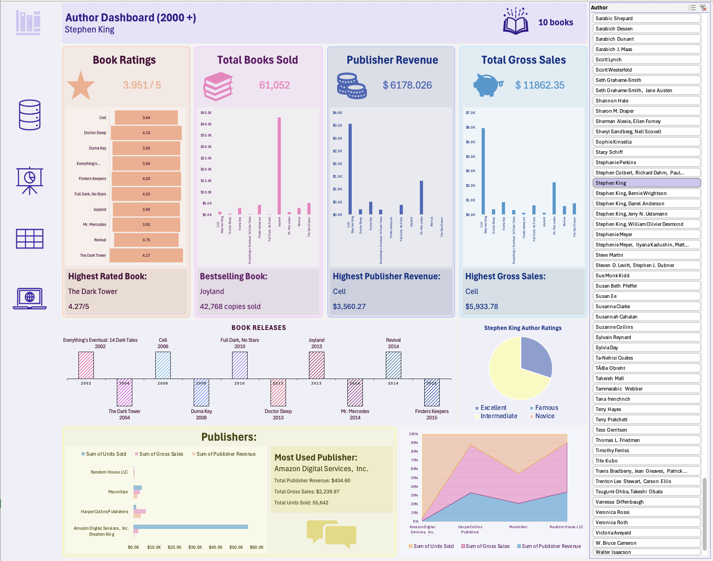

# BookAuthors

    

## Motivation
This project is inspired by my love of reading. I wanted to explore a database of book sales information, with a particular focus on books released after the year 2000. More specifically, I was curious about author information (I wanted to see how my favourite authors are doing). I wanted get insights about an authors popularity, general rating, and sales trends. I used excel to perform a general cleaning of the database and then developed an interactive dashboard to present my findings. 
**Goal:** Gain insights into Author Popularity and Trends

## Task List
1. Clean Table (_Cleaned Table:_ [AuthorsProjectTable.csv](https://github.com/johannaschmidle/BookAuthors/blob/main/AuthorsProjectTable.csv))
2. Create interactive Excel dashboard ([AuthorsProject.xlsx](https://github.com/johannaschmidle/BookAuthors/blob/main/AuthorsProject.xlsx))
   
## Metrics and Dimensions
- **Average Book Rating:** The average rating given to the book by readers
- **Units Sold:** Total number of copies sold
- **Gross Sales:** The total sales revenue generated by each book
- **Publisher Revenue:** The revenue earned by publishers from selling each book

## Summary of Insights
**Note:** You can analyze any author in the list but here is the summary for the author Stephen King
#### Average Book Rating
- Stephen King has an average book rating of around 3.95/5★
- His highest rated book is _The Dark Tower_ (2004) with a rating of 4.27★
- His lowest rated book is Cell (2006) with a rating of 3.64★
#### Units Sold
- He has a total of 61,052 units sold
- He sold the most copies of the book _Joyland_ (2013), with 42,768 copies sold
- He sold the least copies of _Everythings Eventual: 14 Dark Tales_ (2002), with 106 copies sold
#### Gross Sales
- He has a total $11,862.35 in gross sales
- His highest grossing book is _Cell_ (2006), with $5,933.78 in gross sales
- His lowest grossing book is _Finders Keepers_ (2015), with $107.90 in gross sales
#### Publisher Revenue
- He earned a total of $6,178.03 in publisher revenue
- The book that earned the highest publisher revenue is _Cell_ (2006), earning $3,560.27 in publisher revenue
- The book that earned the lowest publisher revenue is _Everythings Eventual: 14 Dark Tales_ (2002), earning $190.00 in publisher revenue (some books were missing this information)
#### Other
- His most used publisher is Amazon Digital Services INC.
- He has 10 recorded books in this database

## Recommended Next Steps 
- Investigate how book sale prices correlate with copies sold and revenue to optimize pricing strategies.
- Merge with an updated database to include more authors and books for comprehensive comparative analysis.
  
## Data
The dataset used in this project is available publicly on DataWorld: [https://data.world/josh-nbu/books](https://data.world/josh-nbu/books)

## Technologies
- Excel
